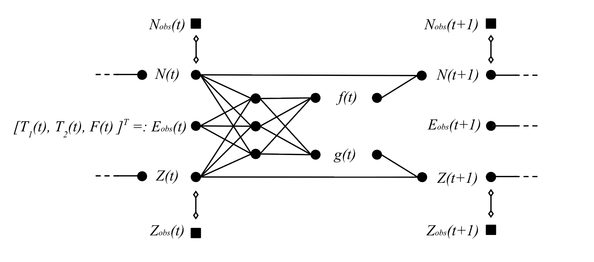

# Eco-phenotypic neural difference equations

## Overview

This repository contains data and code to define and train a neural difference equation (NDE) system on time series of mean body mass of fish and population size.
The aim is to quantify the effects of population density, mean body mass, winter and summer temperature, and harvesting on phenotype and population dynamics.
The approach identifies the degree of non-linearity in effects and interactions between variables that is supported by the time series data.
For more details see the associated publication ([ref]).



## Setting up

You need to install R. 
Computations were performed in R version 4.5.2 (2025-10-31).
Running the code only relies on base R packages.

## General structure of repository

All code and data can be found in the folder `src`.
All files that begin with the file indicator `f_`, e.g. `f_slp.r`, only contain function definitions supporting computations in the main scripts.
The main executable scripts are marked by the file indicator `m<script_number>_` where the script number indicates the order in which to scripts should be executed, e.g. `m1_prepare_raw_data.r` needs to be executed first.

## Instructions for running scripts

The code can be run from command line or interactively in RStudio.
To run in command line do the followin:

```r
Rscript m1_format_raw_data.r        # Format raw data into population-specific time series in data folder
Rscript m2_prepare_data.r           # Combine population-specific time series into single time series file src/data/MTS_all.csv
Rscript m3_fit-nde-v-2026-02-21.r   # Analyse single time series file with eco-phenotypic neural difference equations
```

## File descriptions

* `src/raw` \
|_ `Masses_all.csv`: csv file containing individual fish bi-annual body mass measurements in the 12 ponds for the entire duration of the experiment (2012—2017). \
|_ `Meteo_France_climate_at_enclosures.txt`: txt file containing mean winter and summer temperature measurements between 2012–2017.
* `src/data` \
|_ `MTS_all.csv`: csv file combining by row the formatted time series data for all 12 artificial ponds prepared for the analysis with a single annual measurement. \
|_ `TS_<A–L>.csv`: csv files containing the formatted time series data for all 12 artificial ponds with bi-annual measurements.
* `src/m1_format_raw_data.r`: R script to convert the raw data (in the `raw` folder) into population-specific formatted time series data (in the `data` folder).
* `src/m2_prepare_data.r`: R script to combine population-specific time series into a single file with time series ID ready for analysis (i.e. `MTS_all.csv`).
* `src/m3_fit-nde-v-2026-02-21.r`: R script to run the NDE analysis of eco-phenotypic dynamics and generate results and figures.
* `src/m3_fit-nde-v-2026-02-21-nonlinear.r`: Same as previous, but setting the parameter sd2_p = 0.3 to assess robustness of results to higher degrees of non-linearities in effects.
* `src/f_betteRplots.r`: R function collection that improves visualisations.
* `src/f_bngm.r`: R function collection for performing Bayesian neural gradient matching (Bonnaffé & Coulson 2023).
* `src/f_model_o.r`: R function collection for define and train the observation model (Bonnaffé & Coulson 2023).
* `src/f_model_p.r`: R function collection for define and train the process model (Bonnaffé & Coulson 2023).
* `src/f_utils.r`: R function collection for basic utilities.
* `src/tab-effects-*`: Results for Table S1, i.e. effects of the variables on the dynamics of the population and phenotype.
* `src/tab-r2-*`: Summary of r-squared values.
* `src/figures-2026-03-03.pdf`: PDF containing plots used in the figures of the manuscript generated by the script `m3_fit-nde-v-2026-02-21.r`.
* `src/figures-2026-03-03-nonlinear.pdf`: Same as before but for non-linear effects (`m3_fit-nde-v-2026-02-21-nonlinear.r`). 

## References

Bonnaffé, W. and Coulson, T., 2023. Fast fitting of neural ordinary differential equations by Bayesian neural gradient matching to infer ecological interactions from time‐series data. Methods in Ecology and Evolution, 14(6), pp.1543-1563.
